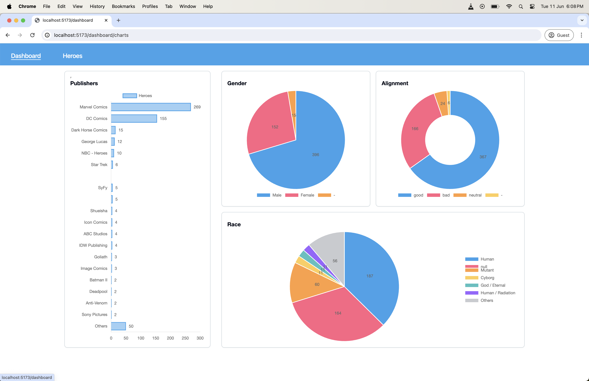
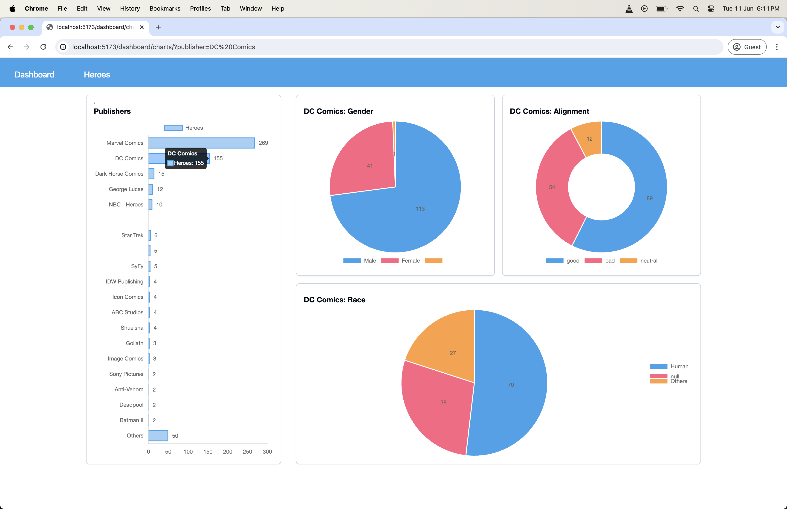
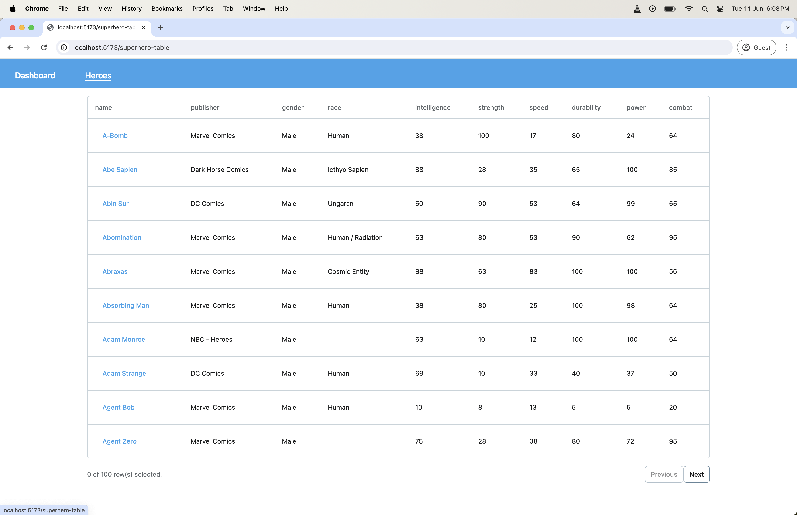
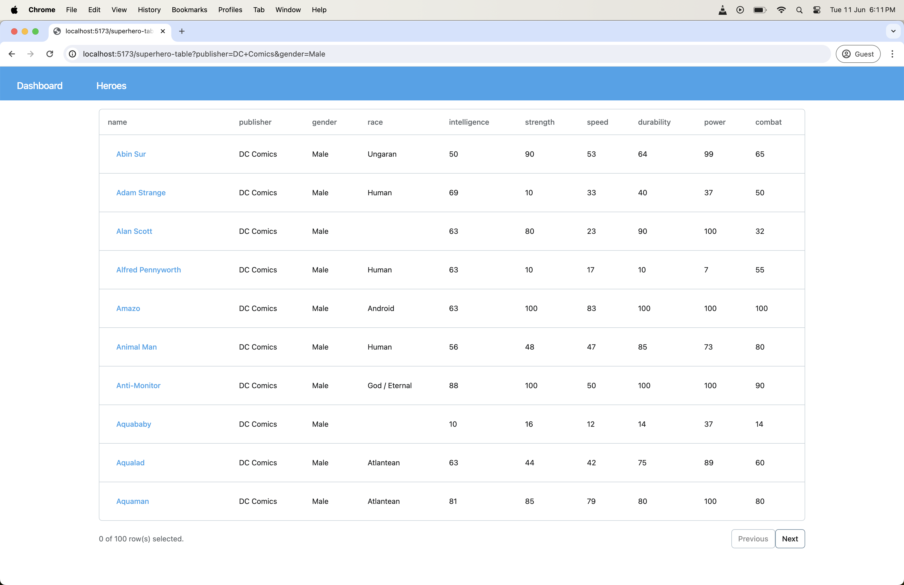
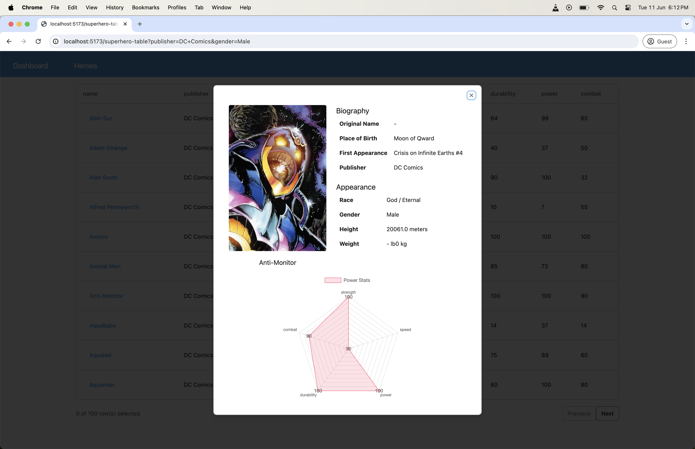

## SuperHero Dashboard
Public data dashboard with visualisation

- Using React, React-router-v6, fetch
- Typecheck, lint and format
- CI scripts
- Dockerifile for deployment

## Build & Run
```
npm install
npm start
```
## Development
```
npm install
npm run start:local
```
## Framework & Tools rational
Documented [here](./notes)

## Flow
### Dashboard
Heroes with different publishers and show Categories like Gender, Alignment, Race.  
All Visualisation are interactive. if you want to get specific data click on the Chart axis  




### Hero List 
Navigated from Charts for filtered lists or from Navigation menu for complete list. Tables are paginated




### Individual Hero Detail
Onclick of Hero name in the Hero Table shows Hero details


### Note: 
- All navigations are based on routes and even if reloaded the data is fetched without breaking.   
- Error boundaries are added for each component so even if a component only that component is impacted not the entire page.   
- Automatic revalidation on update 

### TODO
- Add Tests

